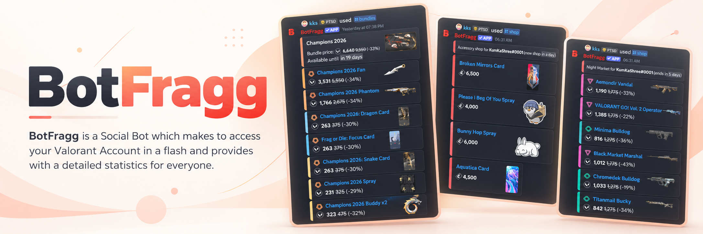

<p align="center">
  
</p>

<h1 align="center">BotFragg</h1>

<p align="center">
  Your VALORANT store, account stats, and skin alerts, right inside Discord.
</p>

<p align="center">
  <a href="https://discord.com/oauth2/authorize?client_id=808657534025072651&amp;permissions=0&amp;scope=bot%20applications.commands">Invite the bot</a>
  &nbsp;·&nbsp;
  <a href="https://discord.gg/VjZ5N8nT4K">Support server</a>
  &nbsp;·&nbsp;
  <a href="docs/api-reference.md">Documentation</a>
  &nbsp;·&nbsp;
  <a href="CHANGELOG.md">Changelog</a>
</p>

<p align="center">
  
</p>

## Overview

BotFragg brings your VALORANT store and account information into Discord. Link one or more Riot accounts to browse your daily shop, featured bundle, and Night Market, check your balances and battlepass progress, and receive private alerts when a skin you want appears in your shop.

Riot credentials are encrypted at rest, and you can delete all of your stored data at any time.

## Features

- **Store access:** View your daily weapon and accessory shops, the featured bundle, and the Night Market.
- **Account insights:** Check VALORANT Points, Radianite Points, Kingdom Credits, battlepass progress, and matchmaking penalties.
- **Private alerts:** Get daily shop updates and skin alerts delivered by direct message.
- **Multiple accounts:** Link several Riot accounts and switch between them.
- **Privacy controls:** Hide your in-game name and permanently delete your stored data.
- **Interactive interface:** Navigate your shop with interactive controls and skin tier emojis.

## Commands

| Category  | Commands                                                                 |
| --------- | ------------------------------------------------------------------------ |
| Account   | `/login`, `/logout`, `/deletedata`, `/account`, `/accounts`              |
| VALORANT  | `/shop`, `/bundles`, `/nightmarket`, `/balance`, `/battlepass`, `/missions`, `/penalties` |
| Alerts    | `/alert`, `/alerts`, `/testalerts`                                       |
| Settings  | `/settings view`, `/settings set`                                        |
| Community | `/help`, `/ping`, `/botinfo`, `/links`, `/suggest`, `/suggestion`        |

> `/userinfo` and `/serverinfo` are owner-only operational commands.

## Getting Started

[Add BotFragg to your server](https://discord.com/oauth2/authorize?client_id=808657534025072651&permissions=0&scope=bot%20applications.commands). The invite requests the `bot` and `applications.commands` scopes. Join the [support server](https://discord.gg/VjZ5N8nT4K) for help and announcements.

## Self-Hosting

You can run your own instance of BotFragg. Each instance requires its own Discord application, bot token, and Fernet encryption key.

### Prerequisites

- Python 3.14
- [uv](https://docs.astral.sh/uv/)
- PostgreSQL (required for production; development uses SQLite by default)
- Docker and Docker Compose (optional, for containerized deployment)

### 1. Create a Discord application

The invite link above installs the hosted BotFragg bot. To run your own instance:

1. Create an application and bot in the [Discord Developer Portal](https://discord.com/developers/applications).
2. Copy the bot token and client ID.
3. In the OAuth2 URL Generator, select the `bot` and `applications.commands` scopes.
4. Grant the following permissions: **View Channels**, **Send Messages**, **Embed Links**, and **Read Message History**.

Administrator permission is not required.

### 2. Run locally

1. Copy the example environment file and set `DISCORD_TOKEN` in `.env`:

   ```sh
   cp .env.example .env
   ```

   On Windows PowerShell:

   ```powershell
   Copy-Item .env.example .env
   ```

2. Install the locked dependencies:

   ```sh
   uv sync --all-groups --frozen
   ```

3. Generate a Fernet key and save it as `TOKEN_ENCRYPTION_KEY` in `.env`:

   ```sh
   uv run python -c "from cryptography.fernet import Fernet; print(Fernet.generate_key().decode())"
   ```

4. Set `APP_ENV=development` in `.env`, then start the bot:

   ```sh
   uv run botfragg
   ```

When `DATABASE_URL` is unset in development, BotFragg uses SQLite.

### 3. Deploy with Docker Compose

1. In `.env`, set `APP_ENV=production`, `DISCORD_TOKEN`, `TOKEN_ENCRYPTION_KEY`, and `DATABASE_URL`. The database URL must point to a PostgreSQL instance reachable from the bot container.
2. Build and start the service:

   ```sh
   docker compose up -d --build
   ```

The Compose service runs database migrations before starting the bot. The included Compose file does not provision PostgreSQL, so you must supply your own instance.

### Prebuilt container image

GitHub Actions publishes the [BotFragg container package](https://github.com/orgs/BotFragg/packages/container/botfragg) after CI passes on pushes to `main` and tags matching `v*`. The `latest` tag tracks `main`, and version and commit SHA tags are also available.

```sh
docker pull ghcr.io/botfragg/botfragg:latest
```

## Configuration

All supported settings are documented in [`.env.example`](.env.example). A typical production setup requires:

| Variable               | Description                                         |
| ---------------------- | --------------------------------------------------- |
| `DISCORD_TOKEN`        | Token for your Discord bot application              |
| `TOKEN_ENCRYPTION_KEY` | Fernet key used to encrypt Riot credentials         |
| `APP_ENV`              | Set to `production` for deployment                  |
| `DATABASE_URL`         | PostgreSQL connection URL (required in production)  |
| `ALERT_TIME_UTC`       | UTC time at which daily shop alerts are sent        |

Optional settings:

- `GLITCHTIP_DSN` enables GlitchTip error reporting.
- `SUPPORT_URL` shows your support server in the `/links` command.

Keep your `.env` file private and never commit it to version control.

## Privacy and Security

BotFragg encrypts Riot credentials and does not store ordinary conversation messages. It processes slash commands and configured operator prefix commands addressed to the bot, including in DMs. You can remove all of your stored data at any time with `/deletedata confirm:True`.

Before using the bot, please review the [Privacy Policy](PRIVACY.md) and [Terms of Service](tos.md). To report a vulnerability, see the [Security Policy](SECURITY.md).

## Documentation

- [API reference](docs/api-reference.md)
- [Repository file guide](docs/code-reference.md)
- [Operational health, recovery, and performance](docs/operations.md)
- [Contributing guide](CONTRIBUTING.md)
- [Security policy](SECURITY.md)
- [Changelog](CHANGELOG.md)

## Contributing

Contributions are welcome. Please read the [contributing guide](CONTRIBUTING.md) before opening an issue or pull request.

## Disclaimer

BotFragg isn't endorsed by Riot Games and doesn't reflect the views or opinions of Riot Games or anyone officially involved in producing or managing Riot Games properties. Riot Games and all associated properties are trademarks or registered trademarks of Riot Games, Inc.

## License

BotFragg is released under the [GNU GPLv3](LICENSE).
